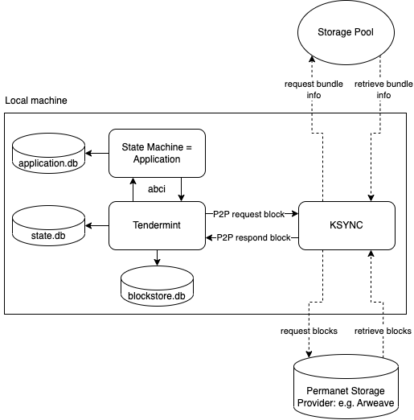
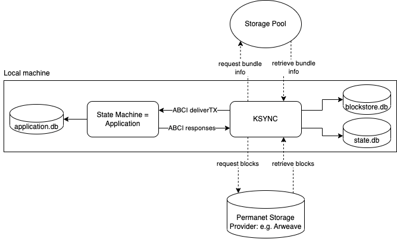

<div align="center">
  <h1>@ksync</h1>
</div>


<p align="center">
<strong>Fast Sync archived and validated blocks from KYVE to every Tendermint based Blockchain Application</strong>
</p>

## Content

- [What is KSYNC?](#what-is-ksync)
- [How does it work?](#how-does-it-work)
- [Installation](#installation)
- [Usage](#usage)
  - [Limitations](#limitations)
  - [P2P-SYNC](#p2p-sync)
    - [Requirements](#p2p-requirements)
    - [Sync node](#sync-node-with-p2p)
  - [DB-SYNC](#db-sync)
    - [Requirements](#db-requirements)
    - [Sync node](#sync-node-with-db)
- [Examples](#examples)
  - [1. Sync Osmosis with DB-SYNC](#1-sync-osmosis-with-db-sync)
  - [2. Sync Cosmos Hub with P2P-SYNC](#2-sync-cosmos-hub-over-p2p-sync)

## What is KSYNC?

Since KYVE is validating and archiving blocks from several blockchains permanently this data can be
used to bootstrap nodes. This is especially helpful since most nodes today are pruning nodes and therefore
finding peers which have the requested blocks becomes harder each day. With KSYNC nodes can retrieve
the data from KYVE and directly feed the blocks into every Tendermint based Blockchain Application in order
to sync blocks and join the network.

## How does it work?

KSYNC comes with two sync modes which can be applied depending on the type of application. There is DB-SYNC
which syncs blocks by directly communicating with the app and writing the data directly to the database and then there
P2P-SYNC where KSYNC mocks a peer in the network which has all the required blocks, streaming them over
the dedicated block channels over to the node.

After a node has been successfully synced with KSYNC the node simply can fetch remaining blocks and switch to live mode
like it would have if synced normally. This makes operating nodes way cheaper and even may make archival nodes
obsolete since blocks archived by KYVE can then be safely dropped in the nodes and synced again once needed
with this tool.

## Installation

To install the latest version of `ksync`, run the following command:

```bash
go install github.com/KYVENetwork/ksync/cmd/ksync@latest
```

To install a previous version, you can specify the version.

```bash
go install github.com/KYVENetwork/ksync/cmd/ksync@v0.1.0
```

Run `ksync version` to check the ksync version.

You can also install from source by pulling the ksync repository and switching to the correct version and building
as follows:

```bash
git clone git@github.com:KYVENetwork/ksync.git
cd ksync
git checkout tags/vx.x.x -b vx.x.x
make ksync
```

This will build ksync in `/build` directory. Afterwards you may want to put it into your machine's PATH like
as follows:

```bash
cp build/ksync ~/go/bin/ksync
```

## Usage

Depending on the blockchain application you are trying to sync the following sync modes can be used.

Whichever sync mode you're using you still have to make sure that the blocks for your node are actually available.
You can check out available storage pools for every KYVE network below: 

- **KYVE (Mainnet)**: https://app.kyve.network/#/pools
- **Kaon (Testnet)**: https://app.kaon.kyve.network/#/pools
- **Korellia (Devent)**: https://app.korellia.kyve.network/#/pools

### Limitations

If you want to sync a node from genesis and the genesis file is bigger than 100MB you have to use P2P because of a
message size limitation in the Tendermint Socket Protocol (TSP).

Currently, p2p sync is only supported for nodes using `github.com/tendermint/tendermint`. If nodes use CometBFT db sync
has to be used. CometBFT support will be added in the future.

### P2P-SYNC

In this sync mode this tool mocks a peer which has all the blocks the actual peer node needs. The
blocks are then streamed over the dedicated block channels and storing them is handled by the node itself.

<p align="center">
  
</p>

#### P2P Requirements

It does not matter if you want to sync a node from genesis or from an existing height, the following settings have
to be changed in order to run p2p sync.

Make sure that `persistent_peers` are empty in the `config.toml` config file:

`~/.<chain>/config/config.toml`
```toml
[p2p]

persistent_peers = ""
```

Make sure that your `addrbook.json` is empty or delete it entirely:

```bash
rm ~/.<chain>/config/addrbook.json
```

And finally enable the following setting:

`~/.<chain>/config/config.toml`
```toml
[p2p]

allow_duplicate_ip = true
```

#### Sync node with P2P

Now you can start your node simply with the `start` command like you would start the node normally.

```bash
./<chaind> start
```

When you see that the  node is trying to search for peers but is unable to find any you can start KSYNC.

> **_ATTENTION:_**  If the node actually finds peers the configuration is wrong, in this case double-check the settings
> above

You can then start KSYNC in a **new** terminal with the following command. Please make sure to replace `<user>` and 
`<chain>` with your specific values. This of course is also true for `<pool>` and `<network-api-endpoint>`.

```bash
ksync start mode=p2p --home="/Users/<user>/.<chain>" --pool-id=<pool> --rest=<network-api-endpoint>
```

Available rest endpoints for every network maintained by KYVE:

- **KYVE (Mainnet)**
  - https://api-eu-1.kyve.network
  - https://api-us-1.kyve.network
- **Kaon (Testnet)**
  - https://api-eu-1.kaon.kyve.network
  - https://api-us-1.kaon.kyve.network
- **Korellia (Devent)**
  - https://api.korellia.kyve.network

Once KSYNC starts it automatically continues from the latest height found in the node and starts downloading
the blocks from the storage provider and validates the checksum. You should see blocks streaming over and the node
committing those blocks. If you run this command without a `--target-height` it will sync all blocks which are
available in the pool. You can simply exit the sync process by killing KSYNC with CMD+C.

### DB-SYNC

In this sync mode this tool mocks the tendermint process which communicates directly with the
blockchain application over ABCI and replays the blocks against the app and manually writes the results
to the DB directly.

<p align="center">
  
</p>

#### DB Requirements

It does not matter if you want to sync a node from genesis or from an existing height, the following settings have
to be changed in order to run DB sync.

Make sure that `proxy_app` and `abci` have the following default values in the `config.toml` config file:

`~/.<chain>/config/config.toml`
```toml
#######################################################################
###                   Main Base Config Options                      ###
#######################################################################

proxy_app = "tcp://127.0.0.1:26658"
abci = "socket"
```

#### Sync node with DB

Now you can start your node with a special flag, so it does not start with tendermint as an embedded process:

```bash
./<chaind> start --with-tendermint=false
```

If you see that the abci server is waiting for new connections you can proceed with starting KSYNC in a **new** 
terminal with the following command. Please make sure to replace `<user>` and
`<chain>` with your specific values. This of course is also true for `<pool>` and `<network-api-endpoint>`.

```bash
ksync start mode=db --home="/Users/<user>/.<chain>" --pool-id=<pool> --rest=<network-api-endpoint>
```

Available rest endpoints for every network maintained by KYVE:

- **KYVE (Mainnet)**
  - https://api-eu-1.kyve.network
  - https://api-us-1.kyve.network
- **Kaon (Testnet)**
  - https://api-eu-1.kaon.kyve.network
  - https://api-us-1.kaon.kyve.network
- **Korellia (Devent)**
  - https://api.korellia.kyve.network

Once KSYNC starts it automatically continues from the latest height found in the node and starts downloading
the blocks from the storage provider and validates the checksum. You should KSYNC committing blocks against the app.
If you run this command without a `--target-height` it will sync all blocks which are
available in the pool. KSYNC will automatically exit once a target height is reached, or you can simply exit the sync 
process by killing KSYNC with CMD+C.

## Examples

All examples below use test data from a KYVE test chain running on `http://35.158.99.65:26657`. This should not be
used in production and is only intended for demonstration purposes.

### 1. Sync Osmosis with DB-SYNC

To sync osmosis you have to download and set up the correct osmosis binary. To sync from genesis the version `v3.1.0` has
to be used. You can download them [here](https://github.com/osmosis-labs/osmosis/releases/tag/v3.1.0) or build them from source: [https://github.com/osmosis-labs/osmosis](https://github.com/osmosis-labs/osmosis)

Verify installation with

```bash
./osmosisd version
3.1.0
```

After the installation init the config

```bash
./osmosisd init <your-moniker> --chain-id osmosis-1
```

download the genesis

```bash
wget -O ~/.osmosisd/config/genesis.json https://github.com/osmosis-labs/networks/raw/main/osmosis-1/genesis.json
```

Important: Don't include an addrbook.json and make sure persistent_peers and etc. are empty for now or else the node will connect to other peers. It should only connect
to our peer.

when the config is done the node can be started

```bash
./osmosisd start --with-tendermint=false
```

After you see that the node is waiting for incoming connections you can open a **new** terminal and start
the sync.

```bash
ksync start --mode=db --home="/Users/<user>/.osmosisd" --pool-id=3 --rest=http://35.158.99.65:1317
```

You should see KSYNC connecting to Osmosis and applying the blocks against the app. After the ~600 blocks were 
applied KSYNC automatically exits.

When you want to continue to sync normally you can now add an addrbook or add peers in `persistent_peers`. When you start
the node again with the normal start command `./osmosisd start` the node should continue normally and tries to sync the remaining blocks.

### 2. Sync Cosmos Hub over P2P-SYNC

Since we want to sync Cosmos Hub from genesis and the genesis file is bigger than 100MB we have to use P2P sync.

To sync cosmos you have to download and set up the correct gaia binary. To sync from genesis the version `v4.2.1` has
to be used. You can download them [here](https://github.com/cosmos/gaia/releases/tag/v4.2.1) or build them from source: 
[https://github.com/cosmos/gaia](https://github.com/cosmos/gaia)

Verify installation with

```bash
./gaiad version
4.2.1
```

After the installation init the project

```bash
./gaiad init <your-moniker> --chain-id cosmoshub-4
```

download the genesis

```bash
wget https://raw.githubusercontent.com/cosmos/mainnet/master/genesis/genesis.cosmoshub-4.json.gz
gzip -d genesis.cosmoshub-4.json.gz
mv genesis.cosmoshub-4.json ~/.gaia/config/genesis.json
```

and edit the following in `~/.gaia/config/config.toml`. TIP: those settings can be found under "p2p"

```toml
allow_duplicate_ip = true
```

Important: Don't include an addrbook.json and make sure persistent_peers and etc. are empty for now or else the node 
will connect to other peers. It should only connect to our peer.

When the config is done the node can be started. NOTE: this can take a while (~5mins) since the genesis file is 
quite big. You can skip invariants checks to boot even fast, but it still takes a long time until the gaia node starts.

```bash
./gaiad start --x-crisis-skip-assert-invariants
```

After you see that the node is searching for peers you can start the tool. For testing KYVE has archived the first
5000 blocks of Cosmos Hub, so after that height is reached the sync will be done.

```bash
ksync start --mode=p2p --home="/Users/<user>/.gaia" --pool-id=0 --rest=http://35.158.99.65:1317
```

You should see the peer connecting and sending over blocks to the gaia node. After all the blocks have been applied
the tool shows _Done_ and you can safely exit the process with CMD+C.

When you want to continue to sync normally you can now add an addrbook or add peers in `persistent_peers`. 
When you start  the node again the node should continue normally and tries to sync the remaining blocks.
