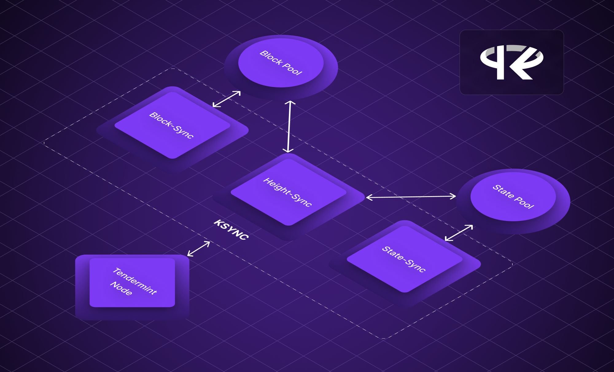

<p align="center">
<strong>Rapidly sync validated blocks and snapshots from KYVE to every Tendermint based Blockchain Application</strong>
</p>

<br/>

<div align="center">
  

  

  

  
</div>

<div align="center">
  <a href="https://twitter.com/KYVENetwork" target="_blank">
    
  </a>
  <a href="https://discord.com/invite/kyve" target="_blank">
    
  </a>
  <a href="https://t.me/kyvenet" target="_blank">
    
  </a>
</div>

<br/>

> [!IMPORTANT]
> In this README you will find information on contribution guidelines and
> detailed documentation about the low level implementation of KSYNC.
>
> You can find the complete documentation on installation and usage
> here: **[https://docs.kyve.network/ksync](https://docs.kyve.network/ksync)**

# Build from Source

You can also install from source by pulling the ksync repository and switching to the correct version and building
as follows:

```bash
git clone git@github.com:KYVENetwork/ksync.git
cd ksync
git checkout tags/vx.x.x -b vx.x.x
make build
```

This will build ksync in `/build` directory. Afterward, you may want to put it into your machine's PATH like
as follows:

```bash
cp build/ksync ~/go/bin/ksync
```

# How to contribute

Generally, you can contribute to KSYNC via Pull Requests. The following branch conventions are required:

- **feat/\***: for a new feature
- **fix/\***: for fixing a bug
- **refactor/\***: for improving code maintainability without changing any logic
- **docs/\***: for upgrading documentation around KSYNC
- **test/\***: for addition or changes in tests

For committing new changes [Conventional Commits](https://www.conventionalcommits.org/en/v1.0.0/) have
to be used.

Once the Pull Request is ready, it can be opened against the `main` branch. Once the owners have approved
your Pull Request your changes get merged.

# Releases

For creating release versions [Semantic Versioning](https://semver.org/) is used. A release is created
by manually creating the release over GitHub. For that the latest commit gets tagged with the new version,
which will also be the title of the release. Once the release is created it gets automatically published to
https://pkg.go.dev/github.com/KYVENetwork/ksync.

# How does KSYNC work?

## Data retrieval

First of all, we need to clarify where KSYNC retrieves it's data in the first place. For that an overview can be found below showing the data sources depending on the sync type used:

<p align="center">
  
</p>

As we can see, KSYNC first reaches out to the KYVE pools, depending on the source synced and on the sync type. There KSYNC queries KYVE's bundles endpoint (e.g. https://api-eu-1.kyve.network/kyve/v1/bundles/0) in order to get the storage ids and the checksums. With that KSYNC can download the actual
data (blocks or snapshot chunks) from the storage provider and verfies the results with the checksum provided by KYVE. With the data now ready KSYNC can start applying this to the tendermint application.

## Data execution

In order for KSYNC to actually sync the blocks or snapshots, KSYNC basically replaces the inbuilt tendermint process and communicates with the app directly over the Tendermint
Socket Protocol (TSP) with the [ABCI](https://github.com/tendermint/spec/blob/master/spec/abci/abci.md) interface.
Once KSYNC has retrieved the requested blocks for the application from a permanent storage provider like Arweave it
executes them against the app and stores all relevant information in the blockstore and state.db databases directly. The
same applies to _state-sync_ snapshots, where KSYNC offers the snapshots over the ABCI methods against the app.

After a node has been successfully synced with KSYNC the node simply can fetch remaining blocks and switch to live mode
like it would have if synced normally. This makes operating nodes way cheaper and even may make archival nodes
obsolete since blocks archived by KYVE can then be safely dropped in the nodes and synced again once needed
with this tool. This process is very similar if KSYNC state-syncs.

Overview of how KSYNC interacts with the tendermint application:

<p align="center">
  
</p>

There is only one exception, if the first block needs to be mined and if the genesis file
is bigger than 100MB the ABCI connection breaks, this is due to a limitation in the TSP protocol, where
incoming message are rejected if they are bigger than this limit. So for successfully calling the
ABCI method `InitChain` (where the ABCI connection breaks) and afterwards executing the first block
we have to go over the P2P network.

Here KSYNC pretends to be a tendermint peer having the first block. After the app connects to KSYNC
it sends over the first block and waits until the first block is executed. Finally KSYNC switches
back to normal mode syncing directly over ABCI (because this is way more efficient).

An overview of how KSYNC syncs the first block over P2P can be found below:

<p align="center">
  
</p>

test
