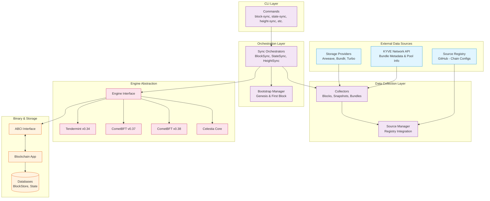
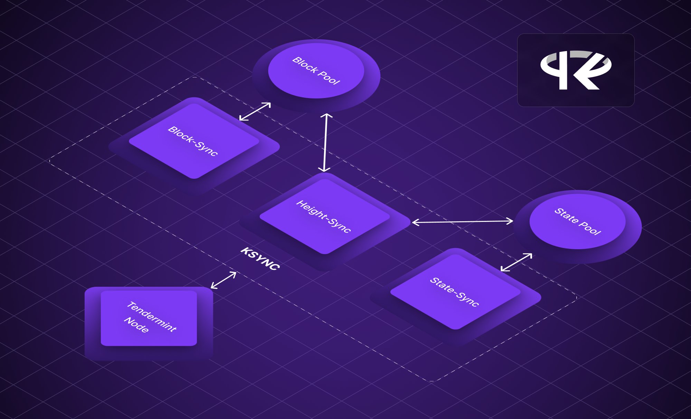
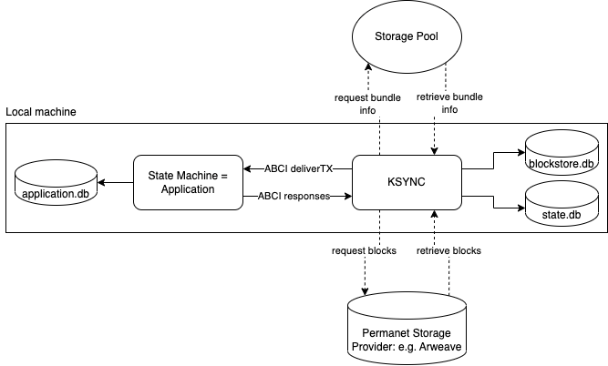
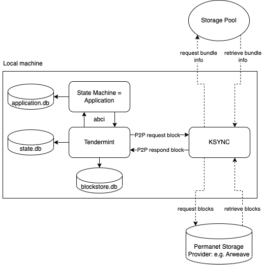

<p align="center">
<strong>Rapidly sync validated blocks and snapshots from KYVE to every Tendermint based Blockchain Application</strong>
</p>

<br/>

<div align="center">
  
  
  
  
</div>

<div align="center">
  <a href="https://twitter.com/KYVENetwork" target="_blank">
    
  </a>
  <a href="https://discord.com/invite/kyve" target="_blank">
    
  </a>
  <a href="https://t.me/kyvenet" target="_blank">
    
  </a>
</div>

<br/>

## Overview

KSYNC is a fast, efficient synchronization tool that enables blockchain node operators to rapidly bootstrap and sync Tendermint/CometBFT-based nodes using validated data from the KYVE network. Instead of replaying the entire blockchain history, KSYNC retrieves pre-validated blocks and snapshots from KYVE's decentralized storage, dramatically reducing sync time and operational costs.

### Key Features

- **Blazing Fast Sync**: Reduce node sync time from days/weeks to hours/minutes
- **Multiple Sync Strategies**: Choose between block-sync, state-sync, or height-sync (combined)
- **Multi-Engine Support**: Compatible with Tendermint v0.34, CometBFT v0.37/v0.38, and Celestia Core
- **Automatic Chain Upgrades**: Detects and handles chain upgrades seamlessly (cosmovisor integration)
- **Data Integrity**: All blocks and snapshots are cryptographically verified against KYVE checksums
- **Snapshot Serving**: Generate and serve snapshots for KYVE data pools
- **Flexible Architecture**: Support for both KYVE bundles and direct RPC endpoints
- **Built-in Utilities**: Backup, prune, and node management tools included
- **Cost Effective**: Eliminate the need for expensive archival node infrastructure

### Use Cases

- **Node Bootstrapping**: Quickly spin up new validator or full nodes
- **Archive Node Alternative**: Drop old blocks and re-sync from KYVE when needed
- **Chain Migration**: Efficiently sync nodes during chain upgrades
- **Snapshot Generation**: Contribute snapshots to KYVE data pools
- **Development & Testing**: Rapidly sync test environments to specific block heights

> [!NOTE]
> For complete installation and usage documentation, visit **[docs.kyve.network/ksync](https://docs.kyve.network/ksync)**

---

## Table of Contents

**For Users:**
- [Quick Start](#quick-start)
- [Installation](#installation)
- [Available Commands](#available-commands)
- [Usage Examples](#usage-examples)
- [Configuration](#configuration)

**For Developers:**
- [Architecture](#architecture)
- [Project Structure](#project-structure)
- [How KSYNC Works](#how-ksync-works)
- [Development Setup](#development-setup)
- [Contributing](#contributing)
- [Releases](#releases)

---

## Quick Start

```bash
# Download the latest release for your platform
# Visit: https://github.com/KYVENetwork/ksync/releases

# Example: Sync Osmosis node to latest height using height-sync
ksync height-sync \
  --binary-path=/path/to/osmosisd \
  --home=/path/to/.osmosisd \
  --chain-id=osmosis-1 \
  --source=kyve

# Example: State-sync to a specific height
ksync state-sync \
  --binary-path=/path/to/gaiad \
  --home=/path/to/.gaia \
  --chain-id=cosmoshub-4 \
  --source=kyve \
  --target-height=15000000
```

---

## Installation

### Download Pre-built Binary

Download the latest release for your platform from the [releases page](https://github.com/KYVENetwork/ksync/releases):

```bash
# Linux AMD64
wget https://github.com/KYVENetwork/ksync/releases/download/vX.X.X/ksync_linux_amd64.tar.gz
tar -xzf ksync_linux_amd64.tar.gz
sudo mv ksync /usr/local/bin/

# macOS
wget https://github.com/KYVENetwork/ksync/releases/download/vX.X.X/ksync_darwin_amd64.tar.gz
tar -xzf ksync_darwin_amd64.tar.gz
sudo mv ksync /usr/local/bin/
```

### Build from Source

**Requirements:**
- Go 1.22.x
- Make

**Build Steps:**

```bash
git clone https://github.com/KYVENetwork/ksync.git
cd ksync
git checkout tags/vX.X.X -b vX.X.X
make build
```

This builds the binary in the `build/` directory. To install system-wide:

```bash
cp build/ksync ~/go/bin/ksync
# or
sudo mv build/ksync /usr/local/bin/ksync
```

### Verify Installation

```bash
ksync version
```

---

## Available Commands

### Sync Commands

| Command | Description | Use Case |
|---------|-------------|----------|
| `block-sync` | Sync blocks sequentially from KYVE bundles | Archive nodes, full history sync |
| `state-sync` | Apply state-sync snapshots from KYVE | Fast bootstrap to recent state |
| `height-sync` | Combined sync: state-sync → block-sync | Recommended for most users |
| `serve-blocks` | Sync from RPC endpoints instead of KYVE | Fallback when KYVE unavailable |

### Snapshot Commands

| Command | Description | Use Case |
|---------|-------------|----------|
| `serve-snapshots` | Generate and serve snapshots via HTTP API | Contributing to KYVE pools |

### Utility Commands

| Command | Description | Use Case |
|---------|-------------|----------|
| `backup` | Create compressed backup of node data | Before upgrades, scheduled backups |
| `prune` | Remove blocks below target height | Disk space management |
| `info` | Display current sync status and height | Monitoring node state |
| `reset-all` | Reset node to genesis state | Fresh start, recovery |
| `version` | Show KSYNC version | Debugging, compatibility checks |

### Global Flags

Common flags available across all sync commands:

| Flag | Description | Default |
|------|-------------|---------|
| `--binary-path` | Path to blockchain application binary | Required |
| `--home` | Home directory for blockchain data | Required |
| `--chain-id` | Chain ID to sync | Auto-detect |
| `--source` | Data source (`kyve`, `rpc`) | `kyve` |
| `--target-height` | Target block height (0 = latest) | `0` |
| `--engine` | Consensus engine version | Auto-detect |
| `--opt-out` | Disable anonymous analytics | `false` |
| `--debug` | Enable debug logging | `false` |
| `--rpc-server` | Enable RPC server on port 7777 | `false` |

---

## Usage Examples

### Example 1: Bootstrap a New Osmosis Node

```bash
# Initialize the node first
osmosisd init my-node --chain-id osmosis-1

# Sync using height-sync (recommended)
ksync height-sync \
  --binary-path=$(which osmosisd) \
  --home=$HOME/.osmosisd \
  --chain-id=osmosis-1 \
  --source=kyve
```

### Example 2: Sync to Specific Height

```bash
# Sync Cosmos Hub to block 15000000
ksync block-sync \
  --binary-path=$(which gaiad) \
  --home=$HOME/.gaia \
  --chain-id=cosmoshub-4 \
  --target-height=15000000
```

### Example 3: State-Sync Only

```bash
# Quick state-sync for Juno
ksync state-sync \
  --binary-path=/usr/local/bin/junod \
  --home=$HOME/.juno \
  --chain-id=juno-1
```

### Example 4: Sync with Auto-Upgrade Support

```bash
# Automatically detect and handle chain upgrades
ksync height-sync \
  --binary-path=$(which osmosisd) \
  --home=$HOME/.osmosisd \
  --chain-id=osmosis-1 \
  --autoselect-binary-version
```

### Example 5: Serve Snapshots for KYVE Pool

```bash
# Generate and serve snapshots on port 7878
ksync serve-snapshots \
  --binary-path=$(which gaiad) \
  --home=$HOME/.gaia \
  --chain-id=cosmoshub-4 \
  --snapshot-pool-id=1
```

### Example 6: Create Backup Before Upgrade

```bash
# Create compressed backup
ksync backup \
  --home=$HOME/.osmosisd \
  --backup-path=$HOME/backups \
  --compress
```

### Example 7: Prune Old Blocks

```bash
# Remove all blocks below height 10000000
ksync prune \
  --binary-path=$(which osmosisd) \
  --home=$HOME/.osmosisd \
  --target-height=10000000
```

### Example 8: Sync from RPC (Fallback)

```bash
# Use RPC endpoint as data source
ksync serve-blocks \
  --binary-path=$(which gaiad) \
  --home=$HOME/.gaia \
  --rpc-server-address=https://rpc.cosmos.network:443
```

---

## Configuration

### Environment Variables

KSYNC respects standard Cosmos SDK environment variables:

```bash
export DAEMON_NAME=osmosisd
export DAEMON_HOME=$HOME/.osmosisd
```

### Cosmovisor Integration

KSYNC works seamlessly with Cosmovisor for automatic binary upgrades:

```bash
# Set up Cosmovisor directories
export DAEMON_NAME=osmosisd
export DAEMON_HOME=$HOME/.osmosisd

# Sync with auto-upgrade support
ksync height-sync \
  --binary-path=$DAEMON_HOME/cosmovisor/genesis/bin/osmosisd \
  --home=$DAEMON_HOME \
  --autoselect-binary-version
```

### Chain Registry Integration

KSYNC automatically fetches chain configuration from the [KYVE Source Registry](https://github.com/KYVENetwork/source-registry):

- Chain ID to KYVE pool mapping
- Engine version per block height
- Automatic version detection for upgrades

To use a custom registry:

```bash
ksync height-sync \
  --registry-url=https://raw.githubusercontent.com/YOUR_ORG/registry/main \
  ...
```

### Data Sources

KSYNC supports two data sources:

1. **KYVE (Recommended)**: Validated bundles from KYVE network
   - Pro: Cryptographically verified, decentralized, cost-effective
   - Con: Requires KYVE pool support for the chain

2. **RPC**: Direct sync from RPC endpoints
   - Pro: Works for any chain with RPC access
   - Con: Slower, single point of trust

```bash
# Use KYVE (default)
--source=kyve

# Use RPC fallback
--source=rpc --rpc-server-address=https://rpc.example.com:443
```

### Storage Providers

KSYNC automatically retrieves data from multiple storage providers:
- Arweave
- Bundlr
- KYVE Storage
- Turbo

No configuration required - KSYNC tries providers in order until successful.

---

# Developer Documentation

## Architecture

KSYNC follows a layered architecture with clear separation of concerns:


```mermaid
graph TB
    subgraph "External Data Sources"
        KYVE[KYVE Network API<br/>Bundle Metadata & Pool Info]
        STORAGE[Storage Providers<br/>Arweave, Bundlr, Turbo]
        REGISTRY[Source Registry<br/>GitHub - Chain Configs]
    end

    subgraph "CLI Layer"
        CMD[Commands<br/>block-sync, state-sync, height-sync, etc.]
    end

    subgraph "Orchestration Layer"
        ORCH[Sync Orchestrators<br/>BlockSync, StateSync, HeightSync]
        BOOTSTRAP[Bootstrap Manager<br/>Genesis & First Block]
    end

    subgraph "Data Collection Layer"
        COLLECTORS[Collectors<br/>Blocks, Snapshots, Bundles]
        SOURCES[Source Manager<br/>Registry Integration]
    end

    subgraph "Engine Abstraction"
        ENGINE[Engine Interface]
        TM34[Tendermint v0.34]
        CB37[CometBFT v0.37]
        CB38[CometBFT v0.38]
        CEL[Celestia Core]
    end

    subgraph "Binary & Storage"
        BINARY[Blockchain App]
        ABCI[ABCI Interface]
        DBS[(Databases<br/>BlockStore, State)]
    end

    KYVE --> COLLECTORS
    STORAGE --> COLLECTORS
    REGISTRY --> SOURCES
    CMD --> ORCH
    ORCH --> BOOTSTRAP
    ORCH --> COLLECTORS
    COLLECTORS --> SOURCES
    ORCH --> ENGINE
    ENGINE --> TM34 & CB37 & CB38 & CEL
    ENGINE --> ABCI
    ABCI <--> BINARY
    BINARY --> DBS

    classDef external fill:#e1f5ff,stroke:#0288d1
    classDef layer fill:#f3e5f5,stroke:#7b1fa2
    classDef engine fill:#fce4ec,stroke:#c2185b
    classDef storage fill:#fff3e0,stroke:#e65100

    class KYVE,STORAGE,REGISTRY external
    class CMD,ORCH,BOOTSTRAP,COLLECTORS,SOURCES layer
    class ENGINE,TM34,CB37,CB38,CEL engine
    class BINARY,ABCI,DBS storage
```

For a detailed architecture diagram with all components, see [assets/architecture.md](assets/architecture.md).

### Architecture Layers

1. **CLI Layer** ([cmd/ksync/commands/](cmd/ksync/commands/))
   - User-facing commands built with Cobra
   - Input validation and configuration parsing
   - User confirmation prompts

2. **Orchestration Layer** ([blocksync/](blocksync/), [statesync/](statesync/), [heightsync/](heightsync/))
   - Business logic for each sync strategy
   - Coordinates between data collection, engine, and binary
   - Handles chain upgrade detection
   - Manages periodic backups

3. **Data Collection Layer** ([collectors/](collectors/), [sources/](sources/))
   - Retrieves blocks/snapshots from KYVE bundles
   - Validates checksums against KYVE metadata
   - Integrates with source registry for pool/version mapping
   - Supports pagination and retries

4. **Engine Abstraction Layer** ([engines/](engines/))
   - Unified interface across Tendermint/CometBFT versions
   - Database management (BlockStore, StateStore)
   - ABCI communication
   - P2P handling for special cases

5. **Binary Process Management** ([utils/process.go](utils/process.go))
   - Starts/stops blockchain application
   - Monitors process health
   - Handles graceful shutdown

6. **Storage & Persistence**
   - RocksDB for block and state storage
   - Managed by consensus engine
   - Direct database writes during sync

---

## Project Structure

```
ksync/
├── cmd/ksync/
│   ├── main.go                 # Application entry point
│   └── commands/               # CLI command definitions
│       ├── root.go             # Root command & global flags
│       ├── blocksync.go        # Block sync command
│       ├── statesync.go        # State sync command
│       ├── heightsync.go       # Height sync command
│       ├── servesnapshots.go   # Snapshot serving command
│       ├── backup.go           # Backup utility
│       ├── prune.go            # Pruning utility
│       └── info.go             # Info command
│
├── blocksync/                  # Block synchronization logic
│   ├── blocksync.go            # Main orchestration
│   └── executor.go             # Block execution engine
│
├── statesync/                  # State synchronization logic
│   ├── statesync.go            # Main orchestration
│   └── executor.go             # Snapshot application
│
├── heightsync/                 # Combined sync strategy
│   └── heightsync.go           # State-sync → Block-sync
│
├── bootstrap/                  # Genesis & first block handling
│   ├── bootstrap.go            # Bootstrap orchestration
│   └── p2p.go                  # P2P first block sync
│
├── engines/                    # Consensus engine abstractions
│   ├── engine.go               # Engine interface definition
│   ├── tendermint-v34/         # Tendermint v0.34 implementation
│   ├── cometbft-v37/           # CometBFT v0.37 implementation
│   ├── cometbft-v38/           # CometBFT v0.38 implementation (default)
│   └── celestia-core-v34/      # Celestia support
│
├── collectors/                 # Data retrieval components
│   ├── blocks.go               # Block collector
│   ├── snapshots.go            # Snapshot collector
│   └── bundles.go              # Bundle downloader
│
├── sources/                    # Chain registry integration
│   ├── registry.go             # Registry client
│   └── pool.go                 # Pool ID mapping
│
├── servesnapshots/             # Snapshot generation & serving
│   └── servesnapshots.go       # Snapshot server
│
├── server/                     # HTTP servers
│   ├── snapshot.go             # Snapshot API server (:7878)
│   └── rpc.go                  # RPC server (:7777)
│
├── backup/                     # Backup utilities
│   └── backup.go               # Backup creation & rotation
│
├── types/                      # Type definitions & interfaces
│   ├── engine.go               # Engine interface
│   └── config.go               # Configuration types
│
├── utils/                      # Common utilities
│   ├── logger.go               # Structured logging
│   ├── process.go              # Binary process management
│   ├── rpc.go                  # RPC client utilities
│   └── constants.go            # Global constants
│
├── build/                      # Build artifacts
├── assets/                     # Documentation assets
│   ├── architecture.md         # Detailed architecture diagram
│   └── *.png                   # Existing diagrams
│
├── Makefile                    # Build automation
├── go.mod                      # Go module definition
└── README.md                   # This file
```

### Key Directories

- **cmd/**: Application entry point and CLI commands
- **blocksync/**: Block-by-block synchronization logic
- **statesync/**: State snapshot application logic
- **engines/**: Abstraction layer for different Tendermint/CometBFT versions
- **collectors/**: Data retrieval from KYVE bundles
- **sources/**: Chain registry and pool configuration
- **utils/**: Shared utilities (logging, RPC, process management)

---

## How KSYNC Works

### Data Retrieval Flow

KSYNC retrieves blockchain data from KYVE's decentralized storage network through the following process:

<p align="center">
  
</p>

**Step-by-Step Data Retrieval:**

1. **Source Registry Lookup** ([sources/registry.go](sources/registry.go))
   - Query KYVE source registry for chain configuration
   - Map `chain-id` to KYVE pool IDs (blocks pool, state-sync pool)
   - Retrieve engine version mappings per block height

2. **Bundle Metadata Retrieval** ([collectors/bundles.go](collectors/bundles.go))
   - Query KYVE API bundles endpoint (e.g., `https://api-eu-1.kyve.network/kyve/v1/bundles/0`)
   - Fetch bundle metadata including:
     - `storage_id`: Location on storage provider
     - `data_hash`: Checksum for validation
     - `from_height` / `to_height`: Block range

3. **Bundle Download** ([collectors/bundles.go](collectors/bundles.go))
   - Download bundle data from storage providers:
     - Arweave (`https://arweave.net/{storage_id}`)
     - Bundlr, KYVE Storage, Turbo (fallbacks)
   - Decompress bundle (gzip/snappy)

4. **Data Validation** ([collectors/blocks.go](collectors/blocks.go), [collectors/snapshots.go](collectors/snapshots.go))
   - Compute checksum of downloaded data
   - Verify against `data_hash` from KYVE metadata
   - Parse blocks or snapshot chunks from bundle

5. **Data Application** (See Data Execution below)

### Data Execution Flow

KSYNC replaces the built-in Tendermint/CometBFT consensus process and communicates directly with the blockchain application via ABCI:

<p align="center">
  
</p>

**Block-Sync Execution** ([blocksync/executor.go](blocksync/executor.go)):

1. **Initialize Engine** ([engines/](engines/))
   ```go
   engine.OpenDBs()           // Open BlockStore and StateStore
   engine.DoHandshake()        // ABCI handshake with app
   ```

2. **Block Application Loop**
   ```go
   for height := startHeight; height <= targetHeight; height++ {
       block := collector.GetBlock(height)
       engine.ApplyBlock(runtime, block)  // ABCI: BeginBlock, DeliverTx, EndBlock, Commit
       engine.SaveBlock(block)             // Write to BlockStore DB
   }
   ```

3. **Chain Upgrade Detection** ([blocksync/executor.go](blocksync/executor.go))
   - Monitor for upgrade heights from source registry
   - Gracefully stop current binary
   - Switch to new engine version
   - Resume sync with new binary

4. **Database Persistence**
   - BlockStore: Blocks, commit info, seen commits
   - StateStore: Validators, consensus params, application state root

**State-Sync Execution** ([statesync/executor.go](statesync/executor.go)):

1. **Snapshot Selection**
   ```go
   snapshots := engine.GetSnapshots()  // Available snapshots from app
   targetSnapshot := findNearestSnapshot(targetHeight, snapshots)
   ```

2. **Snapshot Download & Application**
   ```go
   for chunkIndex := 0; chunkIndex < totalChunks; chunkIndex++ {
       chunk := collector.GetSnapshotChunk(chunkIndex)
       engine.ApplySnapshotChunk(chunkIndex, chunk)  // ABCI: ApplySnapshotChunk
   }
   engine.OfferSnapshot(snapshot)  // ABCI: OfferSnapshot
   ```

3. **State Restoration**
   - Application restores state from snapshot chunks
   - KSYNC writes minimal block metadata to BlockStore
   - Node ready to continue from snapshot height

### Special Case: P2P Bootstrap for Large Genesis

When genesis file exceeds 100MB, the TSP (Tendermint Socket Protocol) message size limit is exceeded during `InitChain`. KSYNC handles this by temporarily acting as a P2P peer:

<p align="center">
  
</p>

**P2P Bootstrap Process** ([bootstrap/p2p.go](bootstrap/p2p.go)):

1. **P2P Server Startup**
   - KSYNC starts a minimal P2P server on port 26656
   - Advertises itself as a peer with the first block

2. **Application Connection**
   - Blockchain app connects to KSYNC as a P2P peer
   - KSYNC sends first block via P2P protocol

3. **First Block Execution**
   - App executes first block (including large genesis)
   - Genesis state committed to StateStore

4. **Switch to ABCI Mode**
   - P2P server shuts down
   - KSYNC resumes normal ABCI sync for remaining blocks
   - More efficient for bulk block application

### Engine Abstraction

KSYNC supports multiple consensus engine versions through a unified interface ([types/engine.go](types/engine.go)):

```go
type Engine interface {
    // Lifecycle
    OpenDBs() error
    CloseDBs() error
    DoHandshake() error

    // Block Operations
    ApplyBlock(runtime, value []byte) error
    SaveBlock(block, seenCommit, valSet []byte, height int64) error
    GetContinuationHeight() int64

    // State-Sync Operations
    GetSnapshots() []byte
    OfferSnapshot(snapshot []byte) error
    ApplySnapshotChunk(index uint32, chunk []byte) (bool, error)

    // Process Management
    StartProxyApp(homePath string) error
    StopProxyApp() error

    // ... more methods
}
```

**Implementations:**
- [engines/tendermint-v34/](engines/tendermint-v34/): Tendermint v0.34 (KYVE fork)
- [engines/cometbft-v37/](engines/cometbft-v37/): CometBFT v0.37
- [engines/cometbft-v38/](engines/cometbft-v38/): CometBFT v0.38 (default)
- [engines/celestia-core-v34/](engines/celestia-core-v34/): Celestia Data Availability

The engine abstraction allows KSYNC to:
- Support chains across different Tendermint/CometBFT versions
- Handle version upgrades automatically
- Maintain consistent sync logic across implementations

### Post-Sync Node Operation

After KSYNC completes synchronization:

1. **Stop KSYNC**: Close databases and proxy connections
2. **Start Normal Node**: Launch Tendermint/CometBFT with the app
3. **Resume Consensus**: Node fetches remaining blocks via P2P
4. **Enter Live Mode**: Participate in consensus or serve queries

This seamless transition makes KSYNC a drop-in replacement for traditional sync methods, with the same end state and no special configuration required.

---

## Development Setup

### Prerequisites

- **Go**: Version 1.22.x (enforced by Makefile)
- **Make**: For build automation
- **Git**: For version control
- **Docker**: Optional, for testing

### Local Development

1. **Clone Repository**
   ```bash
   git clone https://github.com/KYVENetwork/ksync.git
   cd ksync
   ```

2. **Install Dependencies**
   ```bash
   go mod download
   go mod verify
   ```

3. **Build**
   ```bash
   make build
   # Binary created at: build/ksync
   ```

4. **Run Locally**
   ```bash
   ./build/ksync --help
   ```

### Code Style

- Follow standard Go formatting: `gofmt` and `goimports`
- Use meaningful variable names
- Add comments for exported functions and types
- Keep functions focused and testable

### Testing

```bash
# Run Docker-based integration tests
make test

# Manual testing against testnet
./build/ksync height-sync \
  --binary-path=/path/to/testnet-binary \
  --home=/tmp/test-node \
  --chain-id=testnet-1 \
  --source=kyve \
  --debug
```

### Debugging

Enable debug logging for detailed output:

```bash
./build/ksync block-sync \
  --binary-path=/path/to/binary \
  --home=/path/to/home \
  --debug
```

Debug logs include:
- Bundle download progress
- ABCI method calls
- Database operations
- Process lifecycle events

### Adding a New Engine Version

To support a new Tendermint/CometBFT version:

1. Create directory: `engines/cometbft-vXX/`
2. Implement the `Engine` interface ([types/engine.go](types/engine.go))
3. Reference existing implementations for patterns
4. Update engine selection logic in commands
5. Add to source registry version mappings

### Adding a New Command

1. Create file: `cmd/ksync/commands/yourcommand.go`
2. Define Cobra command with flags
3. Implement command logic or call orchestrators
4. Register in `root.go`

Example:
```go
var yourCmd = &cobra.Command{
    Use:   "your-command",
    Short: "Short description",
    RunE: func(cmd *cobra.Command, args []string) error {
        // Command logic
        return nil
    },
}

func init() {
    rootCmd.AddCommand(yourCmd)
    // Add flags
}
```

---

## Contributing

### Branch Conventions

All contributions should follow these branch naming conventions:

- **feat/\***: New features
- **fix/\***: Bug fixes
- **refactor/\***: Code improvements without logic changes
- **docs/\***: Documentation updates
- **test/\***: Test additions or modifications

### Commit Guidelines

Use [Conventional Commits](https://www.conventionalcommits.org/en/v1.0.0/) for all commit messages:

```
feat: add support for CometBFT v0.39
fix: handle empty bundle response gracefully
docs: update installation instructions
test: add unit tests for snapshot collector
```

### Pull Request Process

1. **Fork & Branch**: Create a feature branch from `main`
2. **Develop**: Make your changes following code style guidelines
3. **Test**: Ensure your changes don't break existing functionality
4. **Commit**: Use conventional commits
5. **PR**: Open a pull request against `main` branch
6. **Review**: Address feedback from maintainers
7. **Merge**: Once approved, your PR will be merged

### Areas for Contribution

- **Engine Support**: Add new Tendermint/CometBFT versions
- **Storage Providers**: Add new storage provider integrations
- **Performance**: Optimize bundle downloads, decompression, or database writes
- **Testing**: Increase test coverage
- **Documentation**: Improve guides, add examples, fix typos
- **Bug Fixes**: Address issues from the issue tracker

---

## Releases

KSYNC uses [Semantic Versioning](https://semver.org/) for releases:

- **MAJOR**: Incompatible API changes
- **MINOR**: New backwards-compatible functionality
- **PATCH**: Backwards-compatible bug fixes

### Release Process

1. Tag the latest commit with new version: `git tag vX.Y.Z`
2. Push tag: `git push origin vX.Y.Z`
3. Create GitHub release with tag as title
4. Release automatically published to [pkg.go.dev](https://pkg.go.dev/github.com/KYVENetwork/ksync)

### Changelog

See [Releases](https://github.com/KYVENetwork/ksync/releases) for detailed changelog of each version.

---

## License

Apache 2.0 License. See [LICENSE](LICENSE) for details.

---

## Community & Support

- **Documentation**: [docs.kyve.network/ksync](https://docs.kyve.network/ksync)
- **Discord**: [discord.com/invite/kyve](https://discord.com/invite/kyve)
- **Twitter**: [@KYVENetwork](https://twitter.com/KYVENetwork)
- **Telegram**: [t.me/kyvenet](https://t.me/kyvenet)
- **Issues**: [GitHub Issues](https://github.com/KYVENetwork/ksync/issues)

---

**Built with :heart: by the KYVE Network team**
