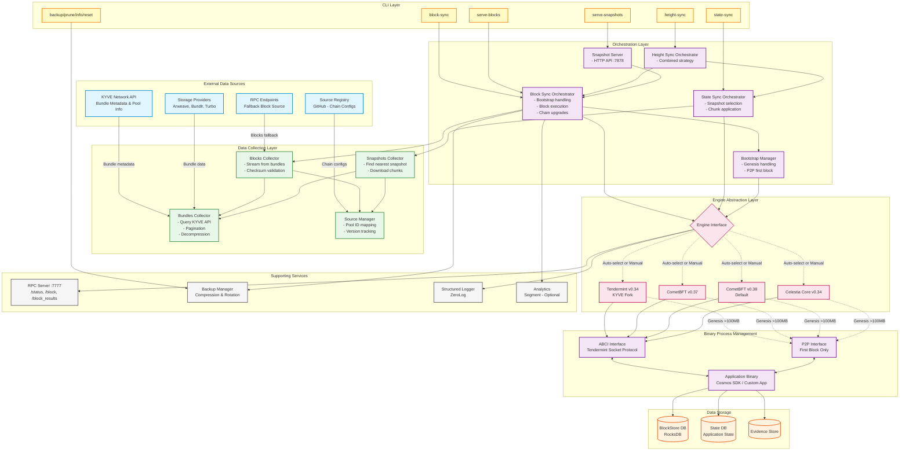

# KSYNC Architecture Diagram

## Component Descriptions

### External Data Sources
- **KYVE Network API**: Provides bundle metadata, checksums, and pool information
- **Storage Providers**: Host actual block/snapshot data (Arweave, Bundlr, Turbo, KYVE Storage)
- **Source Registry**: GitHub-hosted YAML configs mapping chains to pools and engine versions
- **RPC Endpoints**: Fallback source for blocks when KYVE data unavailable

### CLI Layer
All user-facing commands:
- **block-sync**: Fast sync blocks from KYVE to target height
- **state-sync**: Apply state-sync snapshots from KYVE
- **height-sync**: Combined sync strategy (state-sync → block-sync)
- **serve-snapshots**: Generate and serve snapshots for KYVE pools
- **serve-blocks**: Sync from RPC endpoints instead of KYVE
- **backup/prune/info/reset**: Utility commands

### Orchestration Layer
Business logic coordinators:
- **Block Sync Orchestrator**: Manages block retrieval, execution, and chain upgrades
- **State Sync Orchestrator**: Handles snapshot selection and chunk application
- **Height Sync Orchestrator**: Optimizes sync by combining strategies
- **Snapshot Server**: HTTP API for serving snapshots to other nodes
- **Bootstrap Manager**: Special handling for genesis and first block (P2P when needed)

### Data Collection Layer
- **Blocks Collector**: Streams blocks from bundles with validation
- **Snapshots Collector**: Finds and downloads nearest snapshot chunks
- **Bundles Collector**: Core logic for querying KYVE API and downloading from storage
- **Source Manager**: Manages chain-to-pool mappings and engine version tracking

### Engine Abstraction Layer
Provides unified interface across consensus engine versions:
- **Tendermint v0.34**: KYVE fork for legacy chains
- **CometBFT v0.37**: Mid-version support
- **CometBFT v0.38**: Default modern version
- **Celestia Core v0.34**: Data availability layer support

### Binary Process Management
- **Application Binary**: The actual blockchain application (e.g., Cosmos SDK app)
- **ABCI Interface**: Primary communication via Tendermint Socket Protocol
- **P2P Interface**: Used only for first block when genesis >100MB

### Data Storage
- **BlockStore DB**: Persistent block storage (RocksDB)
- **State DB**: Application state (varies by app)
- **Evidence Store**: Byzantine evidence storage

### Supporting Services
- **RPC Server**: Tendermint-compatible RPC endpoints for monitoring
- **Backup Manager**: Automated backups with compression and rotation
- **Logger**: Structured logging with ZeroLog
- **Analytics**: Optional anonymous usage tracking via Segment
